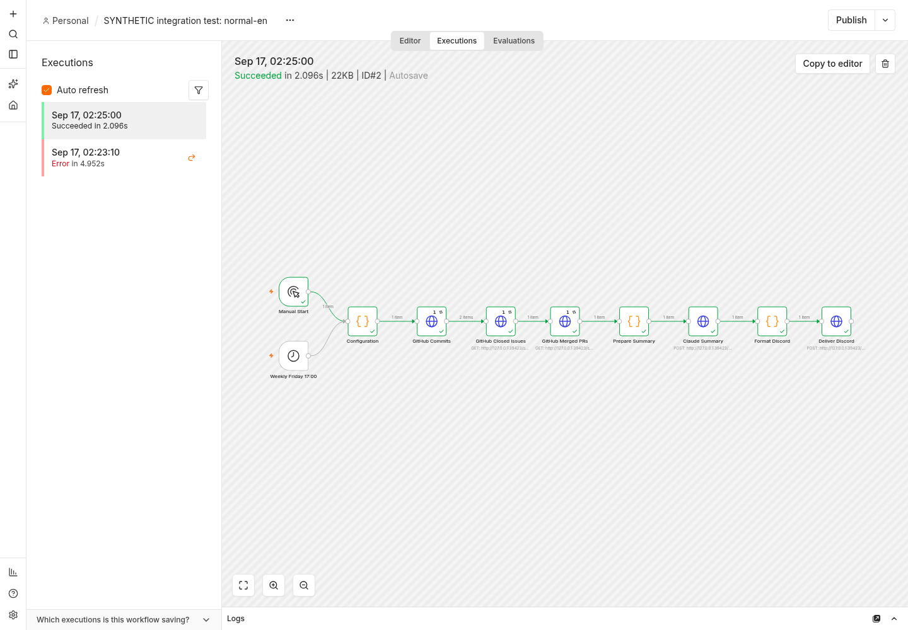

# Verification and reproduction

## Code-level tests

Run `node --test test/workflow.test.cjs`. The current suite has 26 passing tests.
The test VM intentionally does not inject a browser `URL` global: this matches
the n8n JavaScript task runner and prevents the compatibility regression found
in the first real-engine run.

## Real n8n engine with synthetic external services

Tested with n8n 2.39.6, Node 24.21.0, and Python 3.14 on Linux amd64.
Point the harness at an installed n8n CLI JavaScript entry point:

```sh
NODE_BIN=/path/to/node N8N_CLI=/path/to/n8n/bin/n8n python3 test/run-engine.py
```

The harness starts local HTTP fixtures and imports separate, inactive test
workflows into a private n8n user directory under `../tool-home/n8n-state`.
It does not use the operator's existing n8n instance or credentials. It changes
the endpoint URLs and removes authentication only in the generated fixture
copies, not in `workflow.json`.

The five scenarios are English, French, an empty week, incomplete GitHub search
results, and a truncated Claude response. Normal cases deliver to the mock
Discord endpoint. The latter two cases must fail without delivering.
Both multi-page commit collection and collected totals are checked.

**Important:** these are real workflow-engine runs but synthetic GitHub,
Claude, and Discord HTTP services. They do not prove a live Anthropic request,
real Discord delivery, or the factual quality of a real model-generated summary.
No external credential is included. Python task-runner warnings from n8n are
nonblocking here because all workflow Code nodes use JavaScript.

The production workflow remains inactive and retains the real provider URLs and
credential references. A live manual run with the operator's own credentials
is still required before activation. The former requested Claude model is
retired; see MODEL-NOTE.md and the maintainer clarification request.

## Real n8n UI evidence



This is an unaltered browser capture of n8n 2.39.6 execution ID 2, which succeeded. The workflow title explicitly identifies synthetic services. It is real engine/UI execution evidence, not evidence of a live Anthropic request or a real Discord message. The earlier UI startup timeout is resolved.

## Live GitHub transport validation

A real n8n execution on September 17, 2026 collected the public
`Bitcoindefi/OpenAO` seven-day window: **2 commits, 2 closed issues, and
13 merged pull requests**. Import and execution both exited successfully.
This complements the deterministic fixtures with actual GitHub REST responses.

Claude and Discord remained explicitly synthetic local HTTP services. This
result does not establish a real Anthropic request or external message delivery.
No GitHub credential was used for this public-repository test. The submitted
production workflow retains its real provider URLs and credential settings.

```sh
NODE_BIN=/path/to/node N8N_CLI=/path/to/n8n/bin/n8n \
  python3 test/run-live-github.py --repository owner/repository
```

Use `--require-activity` to require at least one activity item. Evidence is saved
in a uniquely dated local folder. Counts naturally change with the reporting
window; this is a smoke test, not a fixed expected-count assertion.
